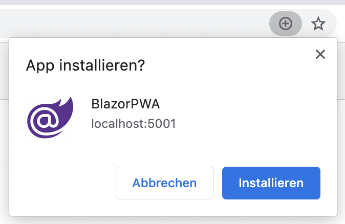

# Blazor Progressive Web App sample

This sample contains the blazor application that is created when using the Blazor WebAssembly template with PWA output enabled (`dotnet new blazorwasm -p`). This will add all assets that are required for a PWA to the project. The Blazor team provides a great documentation on Blazor PWA support https://docs.microsoft.com/en-us/aspnet/core/blazor/progressive-web-app?view=aspnetcore-3.1&tabs=visual-studio.

# Running the sample

Running the samples requires the installation of the .NET Core SDK 3.1.3 (3.1.201) https://dotnet.microsoft.com/download/dotnet-core/3.1

The sample is simply started using `dotnet run` in the specifc folders.

Offline support is only enabled when publishing the application (`dotnet publish`) and hosting it in an application server.

After starting the sample and loading it in your browser of choice, you can install the PWA to your device.
